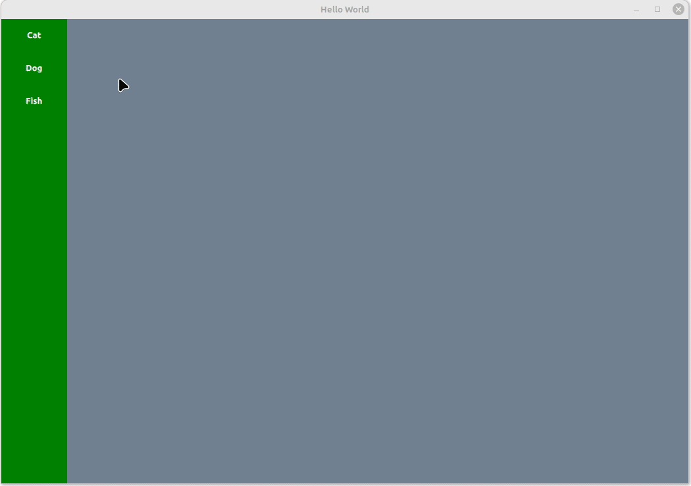
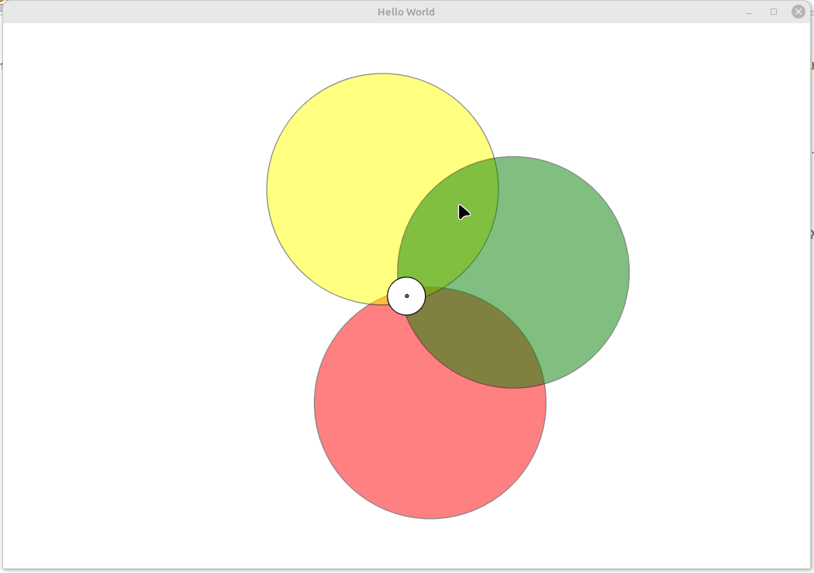
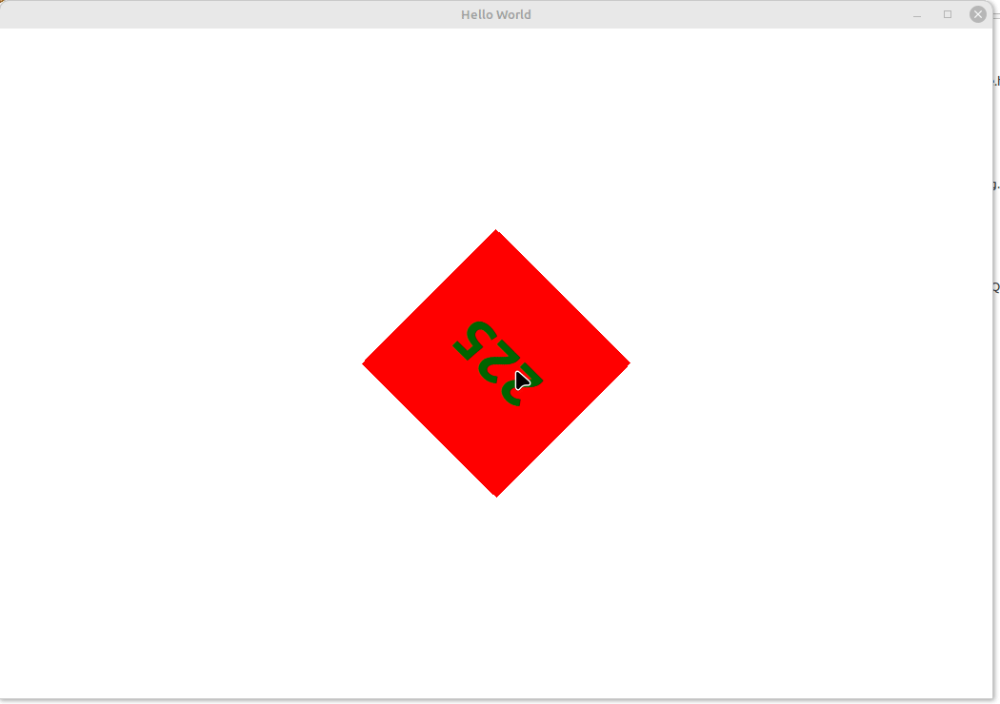
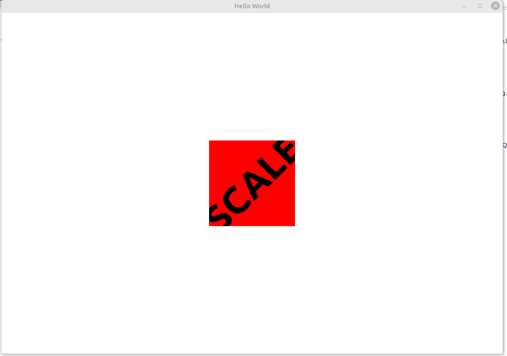
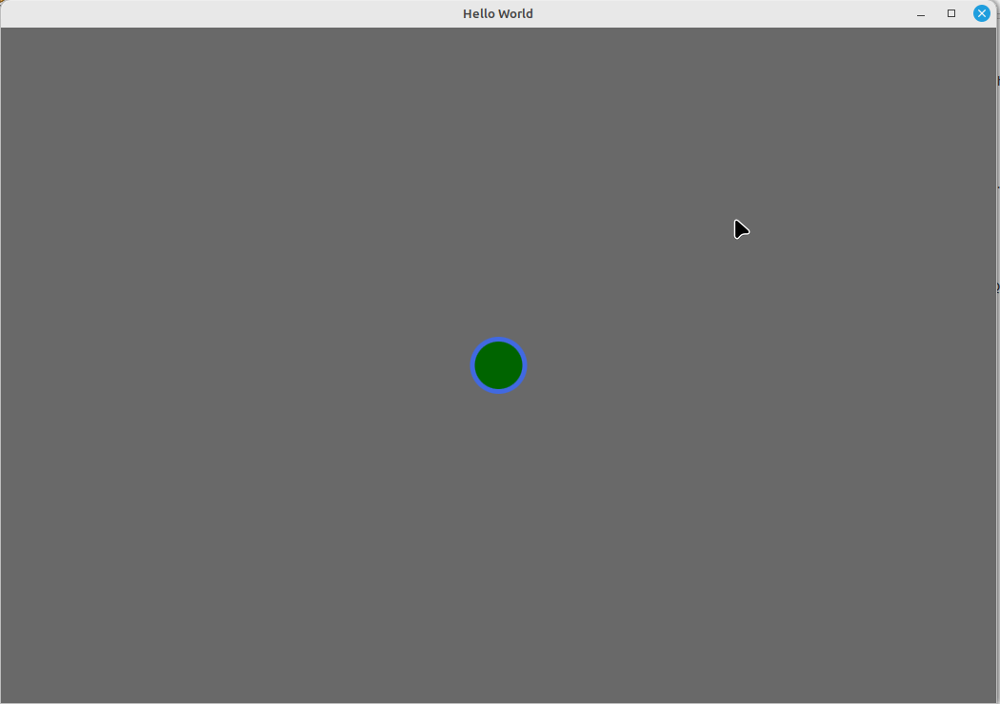
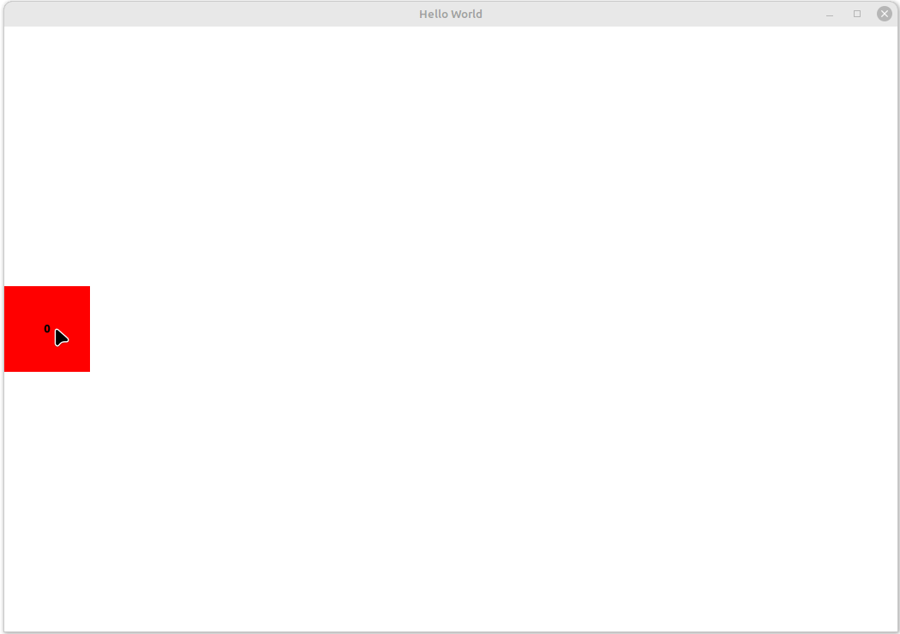

# QT_QML_PROJECTS

This repository contains a collection of Qt/QML projects, each housed in its own directory. The purpose of this repo is to showcase various GUI applications built using Qt and QML, demonstrating different functionalities and designs. Each project directory includes source files, resources, and build configurations, with a demo GIF for each project stored in the `projects_GIF` directory.

## Project Structure

The repository is organized as follows:
- **projectX/**: Directory for each project, containing source files (`main.cpp`, QML files), resources (e.g., images), and build files (e.g., `CMakeLists.txt`).
- **projects_GIF/**: Directory containing GIFs demonstrating each project's functionality.
- **readme.md**: This file, providing an overview and details of all projects.

## Projects

## Project 1: Image Viewer with Hover Buttons

**Demo**:  

##
## Project 2: 

**Demo**:  

##
## Project 3: 

**Demo**:  

##
## Project 4: 

**Demo**:  

##
## Project 5: 

**Demo**:  

##
## Project 6: 

**Demo**:  

##
## Project 7: 

**Demo**:  

##
## Contributing

Feel free to fork this repository, add new projects, or improve existing ones. Submit pull requests with a clear description of changes and include a demo GIF for new projects.

## License

This repository is licensed under the MIT License. See [LICENSE](LICENSE) for details.