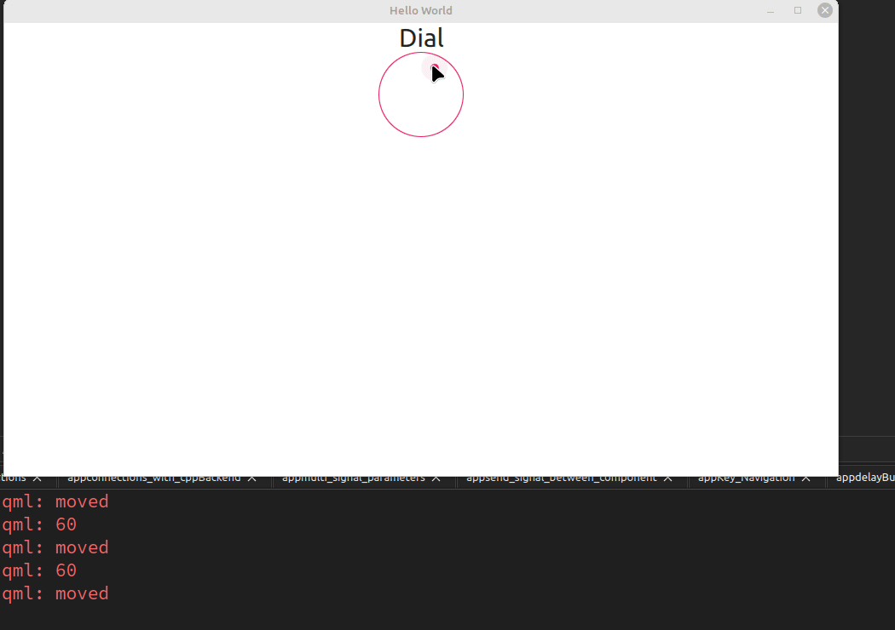
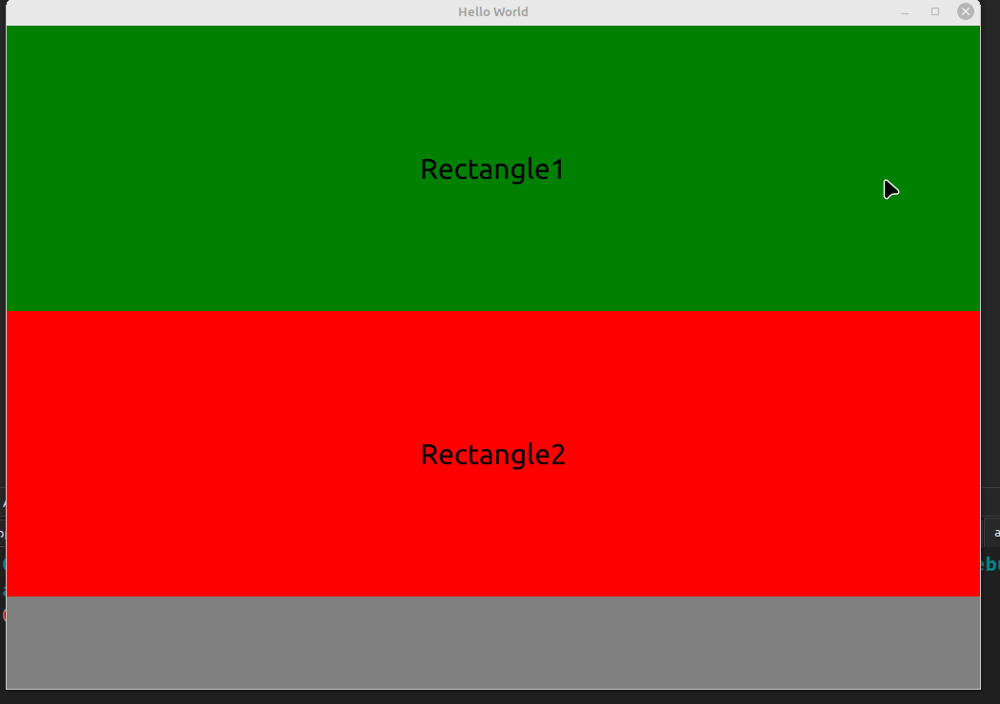
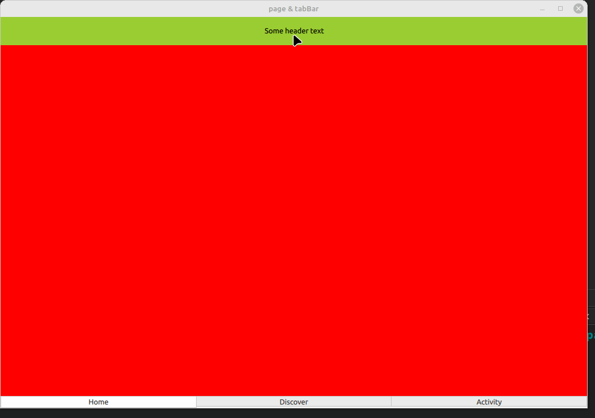
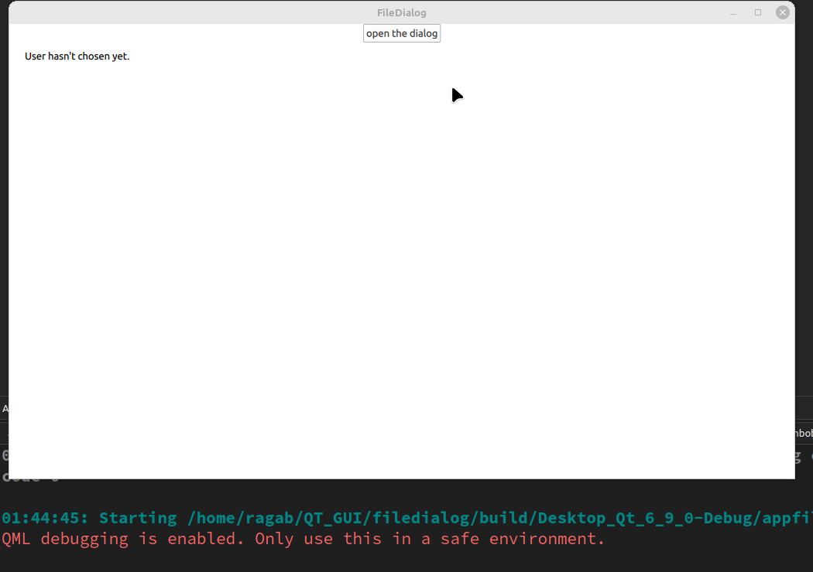
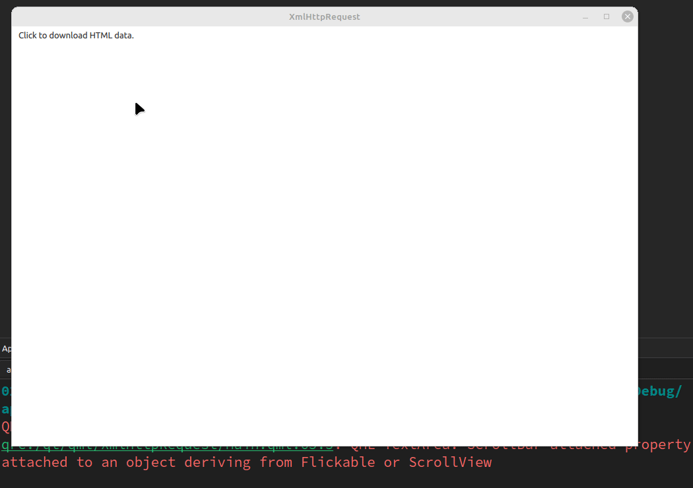

# QT_QML_PROJECTS

This repository contains a collection of Qt/QML projects, each housed in its own directory. The purpose of this repo is to showcase various GUI applications built using Qt and QML, demonstrating different functionalities and designs. Each project directory includes source files, resources, and build configurations, with a demo GIF for each project stored in the `projects_GIF` directory.

## Project Structure

The repository is organized as follows:
- **projectX/**: Directory for each project, containing source files (`main.cpp`, QML files), resources (e.g., images), and build files (e.g., `CMakeLists.txt`).
- **projects_GIF/**: Directory containing GIFs demonstrating each project's functionality.
- **readme.md**: This file, providing an overview and details of all projects.

## Projects

### Project 1: Image Viewer with Hover Buttons

**Demo**:  

### Project 2

**Demo**:  

### Project 3

**Demo**:  

### Project 4

**Demo**:  

### Project 5

**Demo**:  

### Project 6

**Demo**:  

### Project 7

**Demo**:  

### Project 8

**Demo**:  

### Project 9

**Demo**:  

### Project 10

**Demo**:  

### Project 11

**Demo**:  

### Project 12

**Demo**:  

### Project 13

**Demo**:  

### Project 14

**Demo**:  

### Project 15

**Demo**:  

### Project 16

**Demo**:  

### Project 17

**Demo**:  

### Project 18

**Demo**:  

### Project 19

**Demo**:  

### Project 20

**Demo**:  

### Project 21

**Demo**:  

### Project 22

**Demo**:  

### Project 23

**Demo**:  

### Project 24

**Demo**:  

### Project 25

**Demo**:  

### Project 26

**Demo**:  

### Project 27

**Demo**:  

### Project 28

**Demo**:  

### Project 29

**Demo**:  

### Project 30

**Demo**:  

### Project 31

**Demo**:  

### Project 32

**Demo**:  

### Project 33

**Demo**:  

### Project 34

**Demo**:  

### Project 35

**Demo**:  

### Project 36

**Demo**:  

### Project 37

**Demo**:  

### Project 38

**Demo**:  

### Project 39

**Demo**:  

### Project 40

**Demo**:  

### Project 41

**Demo**:  

### Project 42

**Demo**:  

### Project 43

**Demo**:  

### Project 44

**Demo**:  

### Project 45

**Demo**:  

### Project 46

**Demo**:  

### Project 47

**Demo**:  

### Project 48

**Demo**:  

### Project 49

**Demo**:  

### Project 50

**Demo**:  

### Project 51

**Demo**:  

## Contributing

Feel free to fork this repository, add new projects, or improve existing ones. Submit pull requests with a clear description of changes and include a demo GIF for new projects.

## License

This repository is licensed under the MIT License. See [LICENSE](LICENSE) for details.